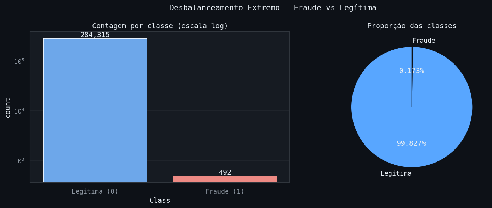
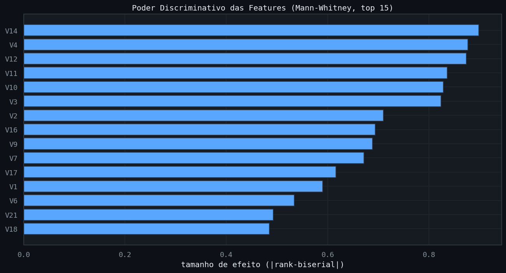
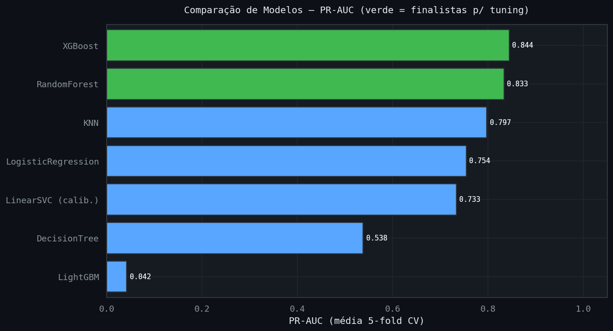
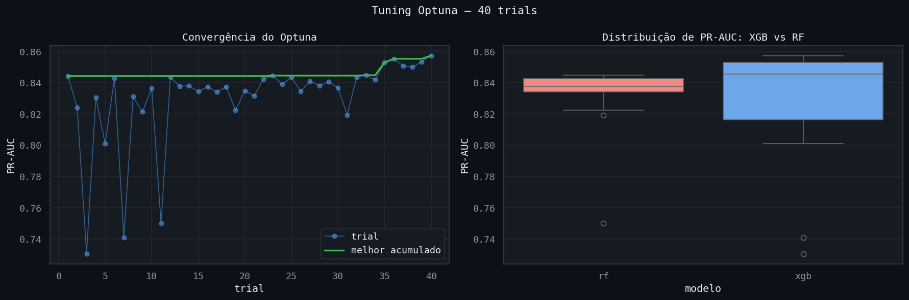
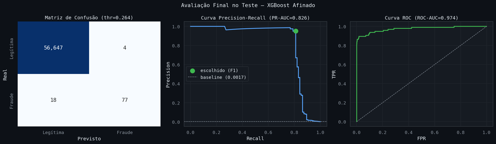
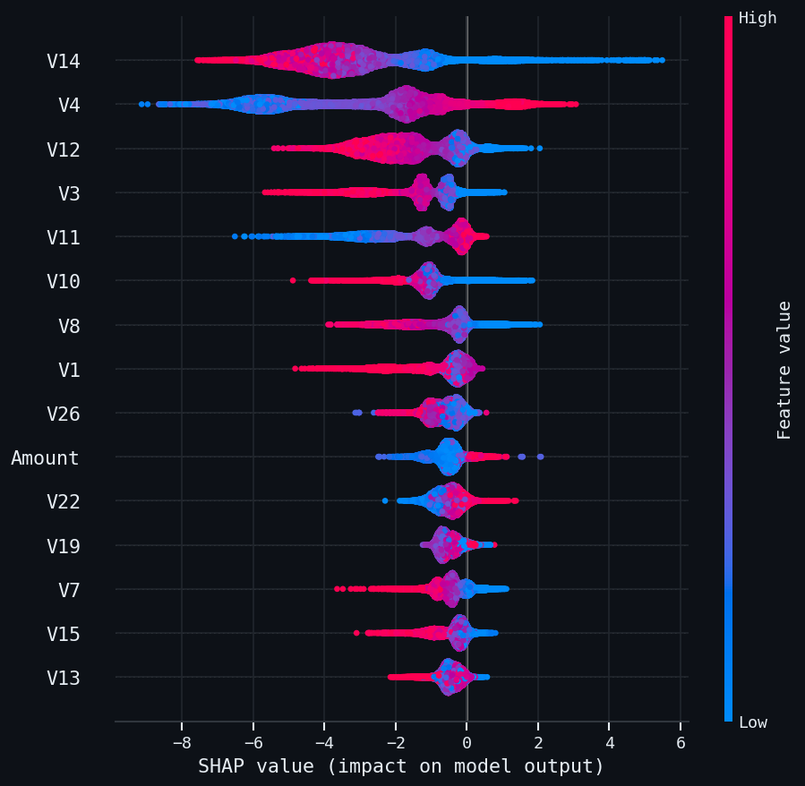
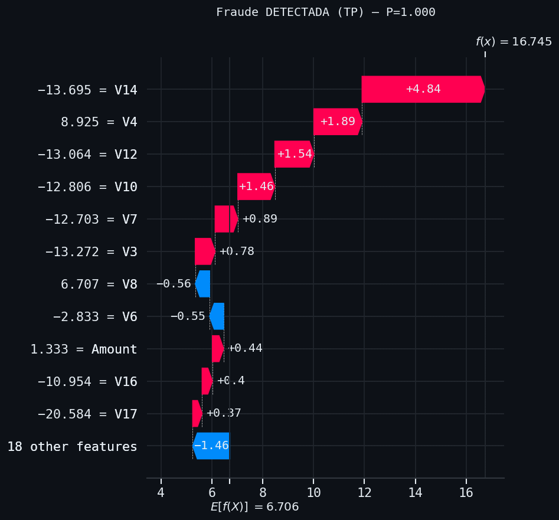
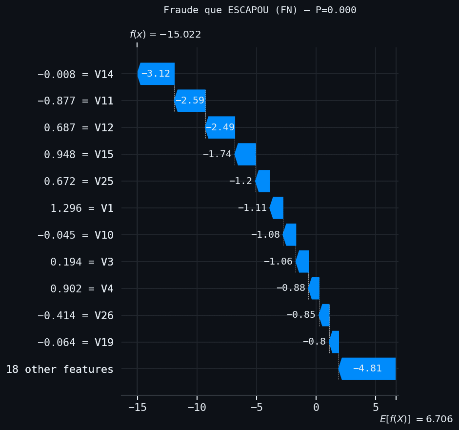

# 💳 Detecção de Fraude em Cartão de Crédito

[](https://python.org)
[](https://scikit-learn.org)
[](https://xgboost.readthedocs.io)
[](https://optuna.org)
[](https://shap.readthedocs.io)
[](https://streamlit.io)
[](LICENSE)

> Pipeline completa de classificação para detecção de fraude em transações de
> cartão de crédito, com **desbalanceamento extremo de 578:1** — validação
> estatística (Mann-Whitney), `Pipeline` sklearn (`RobustScaler → XGBoost`),
> tuning via Optuna e interpretabilidade com SHAP.

🔗 **[Acessar App no Streamlit Cloud](https://creditcardfraud-cmcvsav6capkwmbjkeuthe.streamlit.app/)**

---

## 📋 Sumário

- [Contexto](#contexto)
- [Resultados](#resultados)
- [Visualizações](#visualizações)
- [Pipeline](#pipeline)
- [Estrutura do Repositório](#estrutura-do-repositório)
- [Como Executar](#como-executar)
- [Principais Insights](#principais-insights)
- [Tecnologias](#tecnologias)
- [Autor](#autor)

---

## Contexto

O dataset **Credit Card Fraud** (ULB / Kaggle) contém **284.807 transações**
de cartão realizadas por portadores europeus em setembro de 2013. O desafio
central é o **desbalanceamento extremo**: apenas 0,17% das transações são
fraude (492 de 284.807), uma razão de **578:1**.

Por privacidade, 28 das 30 features (`V1`–`V28`) são componentes de **PCA**
anonimizados; apenas `Time` e `Amount` são originais. Isso transforma o projeto
em um exercício de modelagem sob desbalanceamento severo, onde a escolha da
métrica e do threshold importa mais que o feature engineering semântico.

| Dado | Valor |
|---|---|
| Fonte | Credit Card Fraud Detection (ULB / Kaggle) |
| Transações | 284.807 (após limpeza: 283.726) |
| Fraudes | 473 (0,167%) |
| Desbalanceamento | 578:1 |
| Features | 30 (V1–V28 PCA + Time + Amount) |
| Métrica primária | PR-AUC (não ROC-AUC) |

---

## Resultados

### Comparativo de Modelos — 5-fold StratifiedKFold + class_weight

| Modelo | PR-AUC | ROC-AUC | Recall | Precision |
|---|---|---|---|---|
| **XGBoost** | **0.844** | 0.978 | 0.820 | 0.901 |
| RandomForest | 0.833 | 0.943 | 0.749 | 0.949 |
| KNN | 0.797 | 0.923 | 0.757 | 0.919 |
| LogisticRegression | 0.754 | 0.982 | 0.907 | 0.058 |
| LinearSVC | 0.733 | 0.980 | 0.577 | 0.867 |
| DecisionTree | 0.538 | 0.858 | 0.717 | 0.743 |

### Modelo Final — XGBoost Afinado (Optuna)

| Métrica | Valor |
|---|---|
| PR-AUC (CV) | 0.857 |
| PR-AUC (teste) | 0.826 |
| ROC-AUC (teste) | 0.974 |
| Recall | 0.811 |
| Precision | 0.951 |
| F1 | 0.875 |
| Threshold | 0.264 |
| TP | 77 |
| FP | 4 |
| FN | 18 |
| TN | 56.647 |

> **Por que PR-AUC e não ROC-AUC?** Com 578:1, o ROC-AUC fica enganosamente
> alto (0.974 até para modelos medianos), pois a classe majoritária domina.
> O PR-AUC é sensível ao desempenho real na classe rara — é a métrica honesta.

### Diferenciais da Refatoração

| Componente | Abordagem |
|---|---|
| EDA | Estatística (D'Agostino, Mann-Whitney, tamanho de efeito) |
| Balanceamento | 4 estratégias comparadas dentro do CV (sem leakage) |
| Pré-processamento | RobustScaler no Amount, V's passthrough, Time descartado |
| Tuning | Optuna 40 trials — XGBoost vs RandomForest na mesma busca |
| Threshold | Otimizado para o trade-off de negócio (máximo F1) |
| Artefato | 1 `pipeline_final.joblib` (transação crua → classe) |

---

## Visualizações

### Desbalanceamento Extremo
> 578:1 — apenas 0,17% das transações são fraude (escala log)



---

### Poder Discriminativo das Features (Mann-Whitney)
> V14, V4 e V12 lideram com tamanho de efeito ~0.9



---

### Comparação de Modelos
> XGBoost e RandomForest no topo do PR-AUC



---

### Tuning Optuna
> 40 trials · XGBoost vence (PR-AUC CV 0.857)



---

### Avaliação Final no Teste
> Matriz de confusão + curvas PR e ROC · threshold 0.264



---

### SHAP Summary
> V14 > V4 > V12 — confirma o ranking da EDA (Mann-Whitney)



---

### SHAP Waterfall — Fraude Detectada vs Fraude que Escapou
> P=1.0 (assinatura extrema, V14≈-13) vs P=0.0 (camuflada, V14≈0)




---

## Pipeline

```
NB01 → NB02 → NB03 → NB04 → NB05 → NB06
 EDA   Feat.  Base   Tuning  SHAP   Rel.
 stat  Eng.   line  Optuna
```

| Notebook | Descrição | Entregável |
|---|---|---|
| `01_eda.ipynb` | EDA estatística · desbalanceamento · Mann-Whitney · normalidade | 4 figuras |
| `02_feature_engineering.ipynb` | Duplicatas · split estratificado · RobustScaler | Splits + preprocessor |
| `03_modelagem_baseline.ipynb` | 4 estratégias de balanceamento · 7 modelos · StratifiedKFold | Comparativo |
| `04_tuning.ipynb` | Optuna 40 trials (XGB vs RF) · threshold ótimo | `pipeline_final.joblib` |
| `05_interpretabilidade.ipynb` | SHAP TreeExplainer · beeswarm · waterfalls TP/FN | 3 figuras |
| `06_relatorio_final.ipynb` | Teste de integridade · relatório HTML | HTML GitHub Dark |

---

## Estrutura do Repositório

```
credit_card_fraud/
├── app/
│   ├── main.py                     # st.navigation()
│   ├── utils.py                    # carregar_pipeline() + threshold
│   ├── style.py                    # tema GitHub Dark
│   └── pages/
├── configs/
│   └── config.yaml
├── data/
│   ├── raw/                        # creditcard.zip
│   └── processed/                  # splits em parquet
├── models/
│   ├── pipeline_final.joblib       # RobustScaler → XGBoost
│   ├── metadados.json              # threshold + métricas
│   └── estudo_optuna.pkl           # estudo completo
├── notebooks/                      # 6 notebooks
├── reports/
│   ├── figures/                    # figuras dos notebooks
│   └── relatorio_final.html
├── src/
│   ├── config.py
│   ├── viz_config.py               # GitHub Dark + seaborn
│   ├── report.py                   # RelatorioHTML (reutilizável)
│   └── __init__.py
├── requirements.txt
├── setup.py
└── README.md
```

---

## Como Executar

### 1. Clonar o repositório

```bash
git clone https://github.com/jhastoledo/credit_card_fraud.git
cd credit_card_fraud
```

### 2. Criar o ambiente

```bash
conda create -n singularity python=3.11
conda activate singularity
pip install -r requirements.txt
pip install -e .
```

### 3. Obter o dataset

Baixar `creditcard.csv` do
[Kaggle — Credit Card Fraud Detection](https://www.kaggle.com/datasets/mlg-ulb/creditcardfraud)
e colocar (compactado como `creditcard.zip`) em `data/raw/`.

### 4. Rodar os notebooks

```bash
jupyter lab
```

### 5. Rodar o app

```bash
streamlit run app/main.py
```

---

## Principais Insights

### PR-AUC é a métrica honesta sob desbalanceamento extremo
Com 578:1, o ROC-AUC chega a 0.974 mesmo para modelos medianos — a classe
majoritária domina a curva. O PR-AUC (0.826) reflete o desempenho real na
detecção de fraude e foi a métrica que guiou todas as decisões.

### O balanceamento mexe no threshold, não no PR-AUC
As 4 estratégias testadas (sem balanceamento, class_weight, SMOTE, SMOTE+under)
produziram PR-AUC praticamente idêntico (0.752–0.755) — as classes são
separáveis o suficiente. O que muda é o trade-off recall/precision, cuja
alavanca real é o **threshold**, otimizado no fim.

### Validação cruzada tripla das features
Três métodos independentes convergiram nas mesmas variáveis: o tamanho de
efeito (Mann-Whitney), a importância global SHAP e os casos individuais — todos
apontam **V14 > V4 > V12** como as mais discriminativas. Robustez real, não
artefato do modelo.

### O teto de recall é estrutural, não falha de ajuste
O modelo detecta com certeza as fraudes de assinatura extrema (V14≈-13), mas
as ~18 que escapam são **camufladas**: seus componentes PCA (V14≈0) imitam
transações legítimas, sem sinal detectável. Os 20% perdidos são um limite do
problema, evidenciado pelo par de waterfalls SHAP (P=1.0 vs P=0.0).

### XGBoost superou RandomForest mesmo com menos exploração
No Optuna, o sampler dedicou 28 trials ao RandomForest e apenas 12 ao XGBoost
— ainda assim o XGBoost atingiu um PR-AUC maior (0.857 vs 0.845), indicando um
teto de desempenho genuinamente superior para este problema.

---

## Tecnologias

**Linguagem**


**Dados e Análise**


**Machine Learning**


**Visualização e App**


**Ambiente**


---

## Autor

<div align="center">

### Jhonnes Toledo

**Físico (BSc & MSc — UFJF) | Pós-graduando em Data Science (UNINASSAU)**

Data Science practitioner com background em física, estatística e
machine learning. Experiência em Python, análise exploratória,
modelagem preditiva e deploy de aplicações.

<br>

[](https://www.linkedin.com/in/jhostoledo/)
[](https://github.com/jhastoledo)
[](mailto:jas_toledo@hotmail.com)

</div>

---

<div align="center">
  <i>284.807 transações · 578:1 desbalanceamento · XGBoost PR-AUC 0.83 ·
  81% das fraudes detectadas com 4 falsos alarmes · SHAP confirma a EDA</i>
</div>
